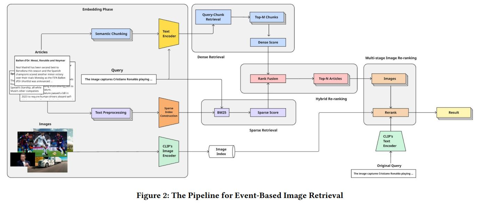

# Overview

Given a real-world caption, this project retrieves matching images from a large database. It addresses challenges such as significantly long, ambiguous or abstract queries, large-scale efficiency, and bias or variation in language. **What makes it unique from other image retrieval tasks**: the textual captions are **drawn from articles** and thus **combine event information and semantic image content**, not just simplified tags.

  

## Methodology

  

Firstly, the framework operates in an **offline preprocessing phase to handle visual and textual data independently**. For images, it employs OpenCLIP (ViT-bigG-14) to generate fixed-length, L2-normalized embedding vectors. For text, it introduces a critical semantic chunking strategy on the article content to substantially alleviate multifaceted-contextual information and preserve coherence, which significantly improved performance from an initial score of 0.17 to 0.52. These chunks are then embedded using the Nomic-v1.5 model for dense semantic representation, while a parallel BM25 index is constructed for sparse lexical matching.

Secondly, during the **online retrieval phase, the system performs a hybrid article retrieval**. An incoming query is processed with a dual embedding strategy to generate both a dense vector (via Nomic) for semantic meaning and a visual vector (via OpenCLIP) for image comparison. The system retrieves an initial set of articles by combining the results from two parallel retrieval methods: dense retrieval, which calculates cosine similarity between the query and text chunks, and sparse retrieval using BM25 scores. These two ranked lists are merged using Reciprocal Rank Fusion (RRF) to leverage the complementary strengths of both semantic and lexical matching:

$$
RRF(A_j) = \frac{1}{k + \text{rank}_{\text{dense}}(A_j)} + \frac{1}{k + \text{rank}_{\text{sparse}}(A_j)}
$$

Finally, the system executes a **multi-stage re-ranking process** on the images associated with the top-retrieved articles. For each candidate image, a cross-modal similarity score is calculated between the visual query embedding and the image's embedding. This score is enhanced by a contextual boosting mechanism that incorporates the semantic similarity between the query and the parent article's text chunks. The final image ranking is determined by a weighted fusion of this contextually-boosted visual score and the parent article's own relevance score, effectively grounding the visual match in its textual context.

For more details, you can check our paper.

## Evaluation

The final result is evaluated on the **OpenEvents V1** dataset, with the ultimate ranking mainly adhere to the **Overall Score** that combines the following five metrics:

| Metric    | Description                                                                 |
|------------|------------------------------------------------------------------------------|
| **mAP**   | Mean Average Precision – measures overall retrieval precision               |
| **MRR**   | Mean Reciprocal Rank – measures how early the first correct item is retrieved |
| **Recall@1** | Whether the correct item is ranked first                                  |
| **Recall@5** | Whether the correct item is within the top 5 results                    |
| **Recall@10** | Whether the correct item is within the top 10 results                  |

These metrics are combined using a **weighted harmonic mean**, which penalizes poor-performing metrics more strongly than an arithmetic mean, and encourages balanced improvements across all criteria:

$$
\text{Overall Score} = r \cdot \left( \frac{\displaystyle \sum_i w_i}{\displaystyle \sum_i \frac{w_i}{m_i + \varepsilon}} \right)
$$

Where:

- *mᵢ* is the value of the i-th retrieval metric  
- *wᵢ* is the weight for the i-th metric  
- *ε* is a small constant (e.g., 10⁻⁸) to avoid division by zero  
- *r* = (# valid queries) / (# total ground-truth queries)

**Default Weights**:  
`[0.3, 0.2, 0.2, 0.15, 0.15]` for **mAP**, **MRR**, **Recall@1**, **Recall@5**, **Recall@10**, respectively.

---

### Leaderboard

Ultimately, our team achieved the top 2 finalist in the EVENTA Grand Challenge - Track 2.

| Rank | Team                  | Overall | AP     | Recall@1 | Recall@5 | Recall@10 |
|------|-------------------------|---------|--------|-----------|------------|-------------|
| 1    | NoResources           | 0.577   | 0.563  | 0.563     | 0.469      | 0.744       |
| **2** | **⭐ 23Trinitrotoluen** | **0.572** | **0.558** | **0.558** | **0.456** | **0.762** |
| 3    | LastSong              | 0.563   | 0.549  | 0.549     | 0.449      | 0.738       |
| 4    | Sharingan Retrievers   | 0.533   | 0.521  | 0.521     | 0.428      | 0.705       |
| 5    | ZJH-FDU                | 0.368   | 0.361  | 0.361     | 0.271      | 0.525       |
