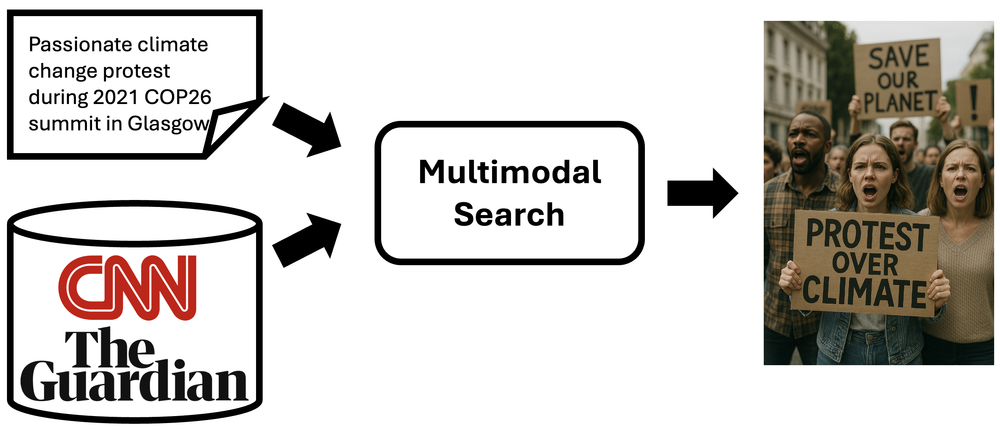

# Overview

Given a real-world caption, this project retrieves matching images from a large database. It addresses challenges such as significantly long, ambiguous or abstract queries, large-scale efficiency, and bias or variation in language. **What makes it unique from other image retrieval tasks**: the textual captions are **drawn from articles** and thus **combine event information and semantic image content**, not just simplified tags.

  

